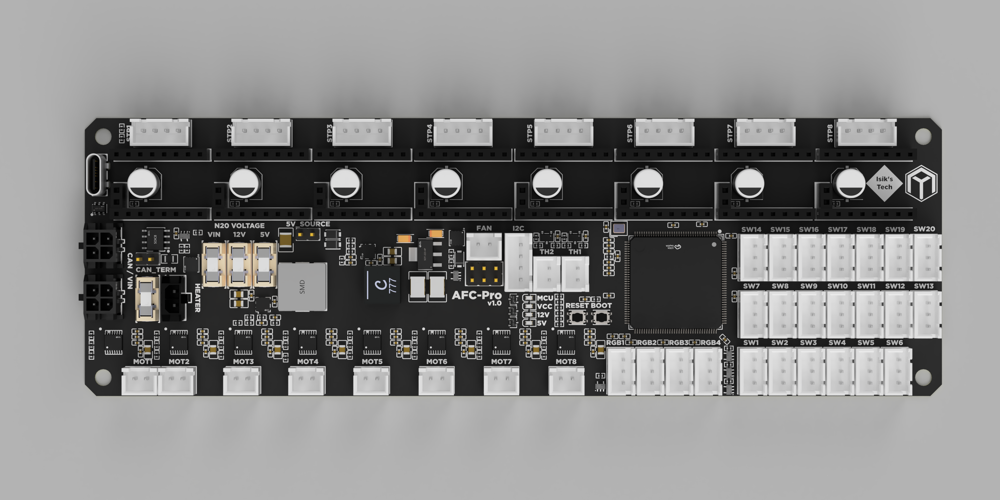

# AFC-Pro

AFC-Pro is a PCB designed for Armored Turtle's Box Turtle AFC system. It features:
- 8x Stepstick Slots for TMC2209-based Stepsticks
- 8x Brushed DC Motor Drivers supporting 5V, 12V and 24V Motors
- 4x ARGB LED Connectors
- 20x Switch Connectors
- 2x Thermistor Connectors
- I2C connector for Chamber Sensors Like Our Nevermore Sensors
- Fan Connector with Selectable Voltage and Speed Control
- Heater Control
- STM32H723 MCU
- USB and CAN Support, With Spare CAN Connector for Daisy Chaining
- 5V and 12V Buck Converters

## Purchasing a AFC-Pro
### Buy From Me (US - Ships Worldwide)
[AFC-Lite - Isik's Tech](https://store.isiks.tech/products/afc-pro)  
We also have [Full BT kits](https://store.isiks.tech/products/box-turtle-kit) and [other BT parts](https://store.isiks.tech/collections/box-turtle-parts) available.

### Resellers
We will add reseller links as they list AFC-Pros.

## Instructions
~~[Manual](./Docs/AFC-Pro_Manual.pdf)~~ Coming Soon

## License
This work is licensed under a
[Creative Commons Attribution-NonCommercial-ShareAlike 4.0 International License][cc-by-nc-sa].

[![CC BY-NC-SA 4.0][cc-by-nc-sa-image]][cc-by-nc-sa]

[cc-by-nc-sa]: http://creativecommons.org/licenses/by-nc-sa/4.0/
[cc-by-nc-sa-image]: https://licensebuttons.net/l/by-nc-sa/4.0/88x31.png
[cc-by-nc-sa-shield]: https://img.shields.io/badge/License-CC%20BY--NC--SA%204.0-lightgrey.svg

## Notes
- Markdown files in this repository may contain Amazon Associate, Aliexpress affiliate, PCBWay affiliate, Jawstec affiliate, Polymaker affiliate links. I make a comission on qualifying purchases.
- This project does not come with any warranty, if you choose to build/use a PCB manufactured using published files in this repository, you are doing this at your own risk!
